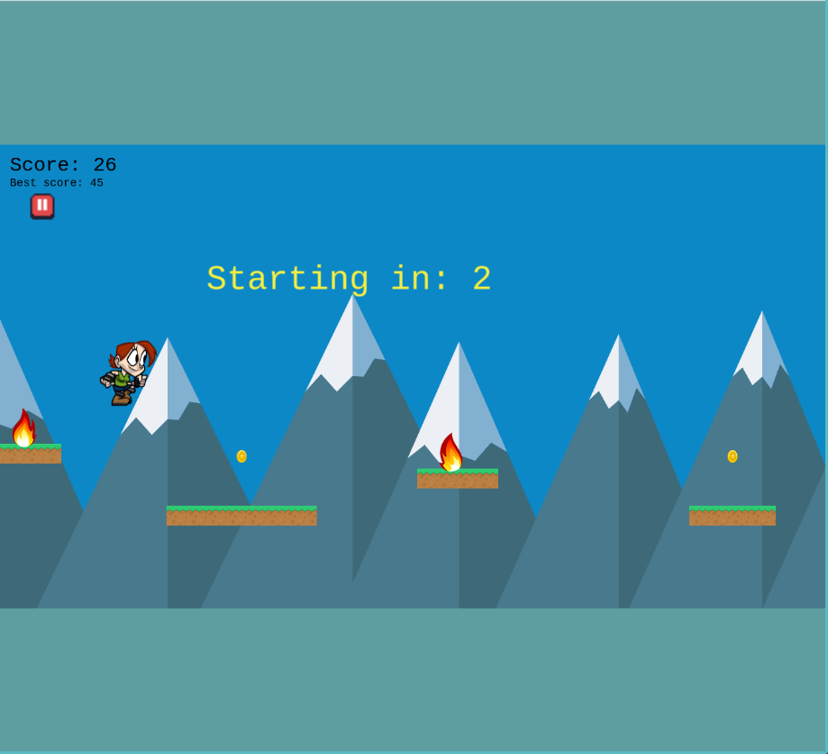
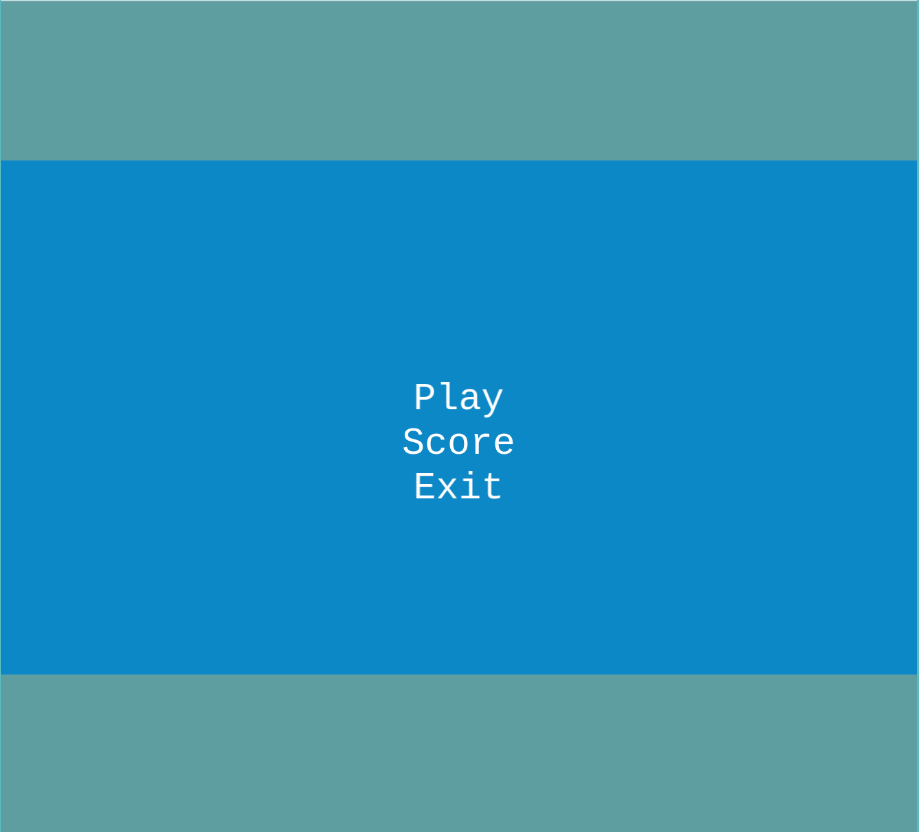

# Endless Game

> This is a version of Endless Game

## Built With

- Phaser
- Javascript
- Webpack

## Live Demo

[Live Demo Link](https://frosty-fermat-dca644.netlify.app/)

## Getting Started

**You can get a copy of this game by clicking on top right corner the green button that says code**

### Prerequisites

- NPM
- Webpack
- Node.js

### Setup

**In your terminal you can type the following commands**
**_`git clone git@github.com:cvilla714/javascriptcapstone.git`_**
**_Next you can type in your terminal `cd javascriptcapstone` and you will be able to get inside the directory_**

### Install

**_Please after getting in the directory you just downloaded just type in `npm install`_**
**_this will install all of the dependecies for the project_**

### Usage

**In order to run the game just type in `npm run start`**
**this will open a new web browser and open the game for you**
**You will be taken to the Menu page where you will choose to**

- Play The Game
- Look at the Best Score
- Exit the game

## How to Play the Game

**Once you click on Play , the game will start.**

- **_To play it you can use your mouse to click and the character will jump or you can use the spacebar and will trigger the jump as well._**

- **_The objective of the game is to collect as many coins as you can this will increase your score_**

- **_The Best Score will be kept saved in memory until a next Best Score is achieved_**

- **_You can pause the game by pressing on the button below the Best Score_**

- **_In order to resume the game you can select from the menu to continue and a counter will show up letting you know that you will have 3 seconds to get ready to play again._**

- **_If you choose to exit the game and start a new one you can do it by selecting exit and then selecting play_**

### Run tests

**To run the test environment you can just need to type in your teminal `npm run test`**

## Authors

👤 **Cosmel Villalobos**

- Github: [@cvilla714](https://github.com/cvilla714)
- Twitter: [@kckeyti](https://twitter.com/kckeyti)
- LinkedIn: [Cosmel Villalobos](https://www.linkedin.com/in/cosvilla/)

## 🤝 Contributing

Contributions, issues and feature requests are welcome!

Feel free to check the [issues page](https://github.com/cvilla714/javascriptcapstone/issues).

## Show your support

Give a ⭐️ if you like this project!

## Acknowledgments

- EMANUELE FERONATO **_I used his template for the game and then added features to it_**
- Filip Jerga **I applied what I learned from this course** **_Game Development in JS - The Complete Guide (w/ Phaser 3)_**

## 📝 License

This project is [MIT](https://github.com/cvilla714/javascriptcapstone/blob/development/LICENSE) licensed.
